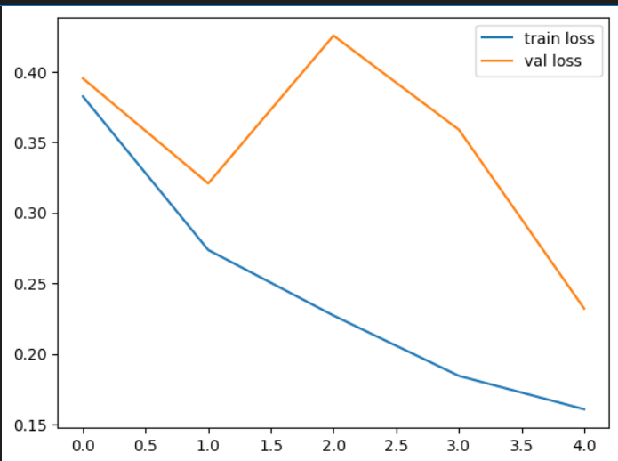
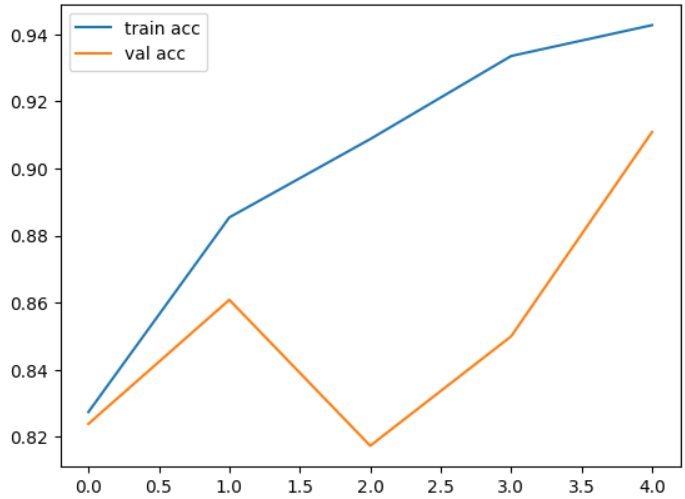
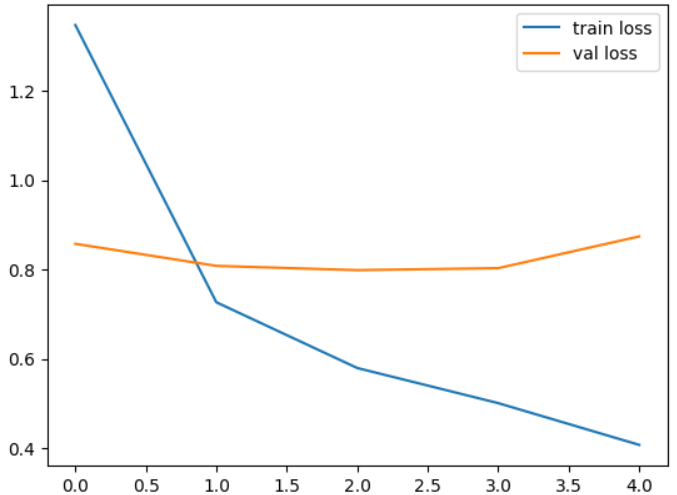
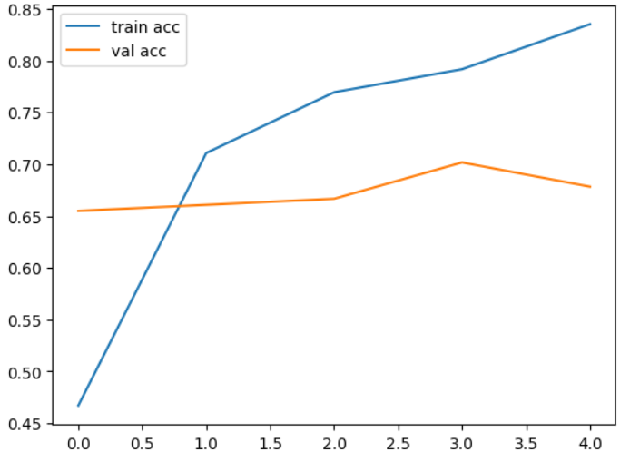
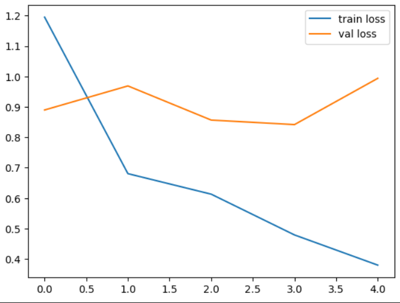
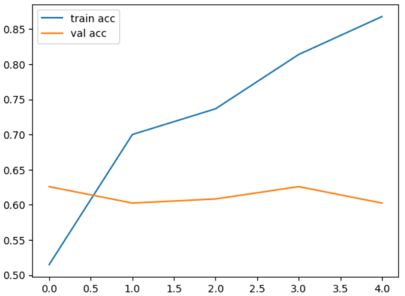

# miniProject

# Crash Guard Backend: Vehicle Damage Detection API

**Crash Guard Backend** integrates three machine learning models for vehicle damage analysis into a Flask API. It provides endpoints for classifying damage, identifying damage location, predicting severity, and generating situational recommendations.

---


⚙️ Backend: Flask API for Vehicle Damage Detection
--------------------------------------------------

The backend of **Crash Guard** is built using **Flask** and serves as the API for vehicle damage detection. It integrates three machine learning models to classify vehicle damage, detect location, predict severity, and generate situational recommendations with optional **Gemini AI** integration.

### 🚀 Features

1.  **Damage vs Whole Classification** -- Determines if the vehicle is damaged or whole.

2.  **Damage Location Classification** -- Identifies location of damage (front, rear, side).

3.  **Damage Severity Classification** -- Predicts severity (minor, moderate, severe).

4.  **Gemini AI Integration** -- Generates automated recommendations for accidents.

5.  **File Upload** -- Users can upload images via API.

6.  **CORS Enabled** -- Allows API calls from different domains.

---

## 📁 Repository Structure

```plaintext
backend/
├── app.py                   # Flask API
├── requirements.txt         # Python dependencies
├── models/
│   ├── damage_or_whole.h5
│   ├── location.h5
│   └── severity.h5
├── static/
│   └── upload/              # Uploaded images
├
│   
└── README.md                # This file

```


### 🛠️ Key Components

-   **Models Loading**

```
fine_tuned_model = load_model('facefeatures_new_model.h5')
```

```
location_model = load_model('model_with_4_classes_front_rear_side.h5')
```

```
severity_model = load_model('model_with_3_classes.h5')
```

-   **Image Preprocessing**

```
    def preprocess_image(image_path):
    # Load, resize, normalize, and optionally enhance image
    ...
```

-   **Classification Functions**

```
def classify_damaged_or_whole(image_path): ...
def classify_damage_location(image_path): ...
def classify_damage_severity(image_path): ...
def classify_car_image(image_path): ...
```
-   **Gemini AI Query**

```
def query_gemini(api_key, question): ...
```
-   **Severity and Recommendation Logic**

`def average_severity(situational_severity, damage_severity): ...
def provide_recommendation(final_severity): ...`

### 📝 API Endpoints

| Endpoint | Method | Description |
| --- | --- | --- |
| `/classify` | POST | Upload an image and get damage classification, location, and severity. |
| `/ask_gemini` | POST | Submit accident report and situational severity to get AI-generated recommendations. |
| `/get_gemini_response` | GET | Retrieve the last generated Gemini AI response. |

#### Example: `/classify` Request

```
curl -X POST -F "file=@car_image.jpg" http://localhost:5000/classify
```

**Response:**

``` 
{
  "result": "The car is classified as damaged. Location: front. Severity: Moderate.",
  "image_url": "static/upload/car_image.jpg"
}
```

#### Example: `/ask_gemini` Request

```
POST /ask_gemini
{
  "accidentReport": "Description of the accident...",
  "situationalSeverity": "Moderate"
}
```

**Response:**

```
{
  "response": "Gemini AI generated advice...",
  "final_severity": "Moderate",
  "recommendation": "You should move legally and claim insurance."
}
```

### ⚡ Notes

-   **Image Requirements:** All uploaded images are resized to 224×224 pixels.

-   **Model Performance:** Uses pre-trained VGG16 base models with custom classification heads.

-   **CORS Enabled:** API can be used from frontend applications on different domains.

# Damage vs Whole Classification Model

## 📊 Model Architecture

### Base Model

- **Pre-trained Model**: VGG16

- **Input Shape**: 224 × 224 × 3

- **Weights**: ImageNet

- **Include Top**: False

### Custom Classification Head

```python

VGG16 Base → Flatten() → Dense(1, activation='sigmoid')

```

## 📁 Dataset Structure

```

data/

├── training/

│   ├── 00-damaged/

│   └── 01-whole/

└── validation/

    ├── 00-damaged/

    └── 01-whole/

```

### Dataset Statistics

| Split       | Total Images | Classes |
|------------|-------------|--------|
| Training    | 1,414       | 2      |
| Validation  | 460         | 2      |


**Class Labels:**

- **0**: Damaged

- **1**: Whole

## 🎯 Training Results

### Phase 1: Transfer Learning (5 Epochs)

| Metric | Training | Validation |
|--------|----------|------------|
| **Accuracy** | 94.27% | 91.09% |
| **Loss** | 0.1606 | 0.2321 |

### Phase 2: Fine-Tuning (5 Epochs)

| Metric | Training | Validation |
|--------|----------|------------|
| **Accuracy** | 66.97% | 50.00% |
| **Loss** | 0.6345 | 0.7524 |

## 📈 Performance Graphs

### Loss Curves



*Training and validation loss across epochs*

### Accuracy Curves



*Model accuracy progression during training*

## 🛠️ Training Pipeline

### Data Preprocessing

```python

train_datagen = ImageDataGenerator(

    rescale=1./255,

    shear_range=0.2,

    zoom_range=0.2,

    horizontal_flip=True

)

```

### Model Configuration

**Initial Training:**

- **Optimizer**: Adam

- **Loss**: Binary Crossentropy

- **Batch Size**: 32

**Fine-Tuning:**

- **Optimizer**: SGD (lr=0.0001, momentum=0.9)

- **Unfrozen Layers**: Last 15 layers

## 🔍 Key Observations

| Aspect| Observation | Impact |
|--------|-------------|---------|
| **Initial Performance** | 91.09% validation accuracy | Excellent baseline |
| **Fine-tuning Result** | 50% validation accuracy | Overfitting detected |
| **Training Stability** | Consistent convergence | Reliable training process |
| **Data Augmentation** | Shear, zoom, flip | Improved generalization |

## 💾 Model Files

| File | Purpose |
|------|---------|
| `facefeatures_new_model.h5` | Primary trained model |
| `fine_tuned_model.h5` | Fine-tuned version |

## 🚀 Inference Code

```python

def classify_damage(image_path):

    model = load_model('models/damage_or_whole.h5')

    img = preprocess_image(image_path)

    prediction = model.predict(img)

    return "Damaged" if prediction[0][0] < 0.5 else "Whole"

```

## ⚠️ Performance Notes

- **Best Model**: Use `facefeatures_new_model.h5` (91.09% accuracy)

- **Fine-tuning**: Requires regularization improvement

- **Production Ready**: Yes, with transfer learning model


2.Vehicle Damage Location Classification 
==============================================================

🏗️ Model Architecture
----------------------

### Base Model: VGG16

-   Pre-trained weights: ImageNet

-   Input size: 224×224×3

-   Transfer learning approach: Feature extraction with frozen base layers

### Custom Classification Head

```python

VGG16 Base (frozen) → Flatten Layer → Dense Layer (3 units, softmax)
```

📊 Dataset Structure
--------------------

```text

dataset/
├── training/
│   ├── front/
│   │   ├── image1.jpg
│   │   ├── image2.jpg
│   │   └── ...
│   ├── rear/
│   │   ├── image1.jpg
│   │   ├── image2.jpg
│   │   └── ...
│   └── side/
│       ├── image1.jpg
│       ├── image2.jpg
│       └── ...
└── validation/
    ├── front/
    ├── rear/
    └── side/
```
### Dataset Statistics

| Split | Total Images | Classes | Class Distribution |
| --- | --- | --- | --- |
| Training | 989 | 3 | Front, Rear, Side |
| Validation | 171 | 3 | Front, Rear, Side |

🔄 Data Pipeline
----------------

### Data Augmentation (Training)

-   Rescaling: 1./255

-   Shear range: 0.2

-   Zoom range: 0.2

-   Horizontal flip: True

### Data Preprocessing (Validation)

-   Rescaling: 1./255 only

⚙️ Training Configuration
-------------------------

| Parameter | Value |
| --- | --- |
| Batch Size | 32 |
| Epochs | 5 |
| Optimizer | Adam |
| Loss Function | Categorical Crossentropy |
| Learning Rate | Default (0.001) |

📈 Training Results
-------------------

### Final Epoch Metrics

| Metric | Training | Validation |
| --- | --- | --- |
| Accuracy | 83.52% | 67.84% |
| Loss | 0.4075 | 0.8742 |


📊 Performance Visualization
----------------------------

### Loss Curve



```text
- Blue line: Training loss decreasing from 1.35 to 0.41
- Orange line: Validation loss fluctuating between 0.86-0.87
- Clear indication of model learning on training data
```
### Accuracy Curve



```text
- Blue line: Training accuracy increasing from 47% to 84%
- Orange line: Validation accuracy plateauing around 68%
- Slight overfitting observed in later epochs
```
🔍 Key Observations
-------------------

### Strengths

-   Rapid convergence: Significant improvement in first 2 epochs

-   Good training performance: 83.52% final training accuracy

-   Effective transfer learning: VGG16 features provided good baseline

### Challenges

-   Overfitting: Gap between training and validation performance

-   Validation plateau: Validation accuracy stabilized around 68%

-   Class imbalance: Potential uneven distribution in dataset


🎯 Conclusion
-------------

The model successfully demonstrates transfer learning capabilities for vehicle damage location classification, achieving reasonable validation accuracy with potential for further optimization through regularization and data enhancement strategies.


# 3.Damage Severity Classification

## 📊 Model Performance


### Final Metrics Summary

| Metric | Value |
|--------|-------|
| **Final Training Accuracy** | 86.78% |
| **Final Validation Accuracy** | 60.23% |
| **Final Training Loss** | 0.3798 |
| **Final Validation Loss** | 0.9939 |

## 🏗️ Model Architecture

### Technical Specifications

| Component | Details |
|-----------|---------|
| **Base Model** | VGG16 (Pre-trained on ImageNet) |
| **Input Shape** | 224×224×3 |
| **Transfer Learning** | Frozen base layers |
| **Custom Head** | Flatten → Dense(3, softmax) |
| **Output Classes** | 3 (minor, moderate, severe) |
| **Optimizer** | Adam |
| **Loss Function** | Categorical Crossentropy |

## 📁 Dataset Structure

```

data3a/

├── training/

│   ├── minor/ (328 images)

│   ├── moderate/ (328 images) 

│   └── severe/ (327 images)

└── validation/

    ├── minor/ (57 images)

    ├── moderate/ (57 images)

    └── severe/ (57 images)

```

**Dataset Statistics:**

- **Total Training Images**: 983

- **Total Validation Images**: 171  

- **Classes**: 3 (balanced distribution)

- **Image Size**: 224×224 pixels

## 🔄 Training Pipeline

### Data Preprocessing

```python

# Training Data Augmentation

train_datagen = ImageDataGenerator(

    rescale=1./255,

    shear_range=0.2,

    zoom_range=0.2, 

    horizontal_flip=True

)

# Validation Data (only rescaling)

test_datagen = ImageDataGenerator(rescale=1./255)

```

### Model Training Configuration

- **Batch Size**: 32

- **Epochs**: 5

- **Steps per Epoch**: 31

- **Validation Steps**: 6

## 📈 Training Visualization

### Loss Progression





*Training loss decreased consistently from 1.1949 to 0.3798, while validation loss fluctuated between 0.8418-0.9939*

### Accuracy Progression  





*Training accuracy improved from 51.48% to 86.78%, while validation accuracy remained around 60-62%*

## 🔍 Key Observations

### Performance Analysis

| Observation | Impact | Recommendation |
|-------------|--------|----------------|
| **High training accuracy (86.78%)** | Model learns training patterns well | - |
| **Lower validation accuracy (60.23%)** | Potential overfitting | Add regularization/dropout |
| **Increasing validation loss** | Model doesn't generalize well | More diverse training data |
| **Consistent training improvement** | Good learning capability | Continue training with early stopping |

### Training Behavior

- **Rapid initial learning**: 51% → 74% accuracy in first 3 epochs

- **Stable validation performance**: Remained around 60-62% throughout

- **Overfitting signs**: Gap between train/val accuracy increases over epochs

- **Convergence**: Training metrics stabilized by epoch 5

## 💾 Model Output

- **Saved Model**: `model_with_3_classes.h5`

- **Model Size**: [File size placeholder]

- **Compatibility**: Keras/TensorFlow format

## 🎯 Inference Example

```python

# Single image classification

result = classify_single_image('input_image.jpg')

print(f"Predicted Severity: {result}")

# Output example: "moderate"

```
